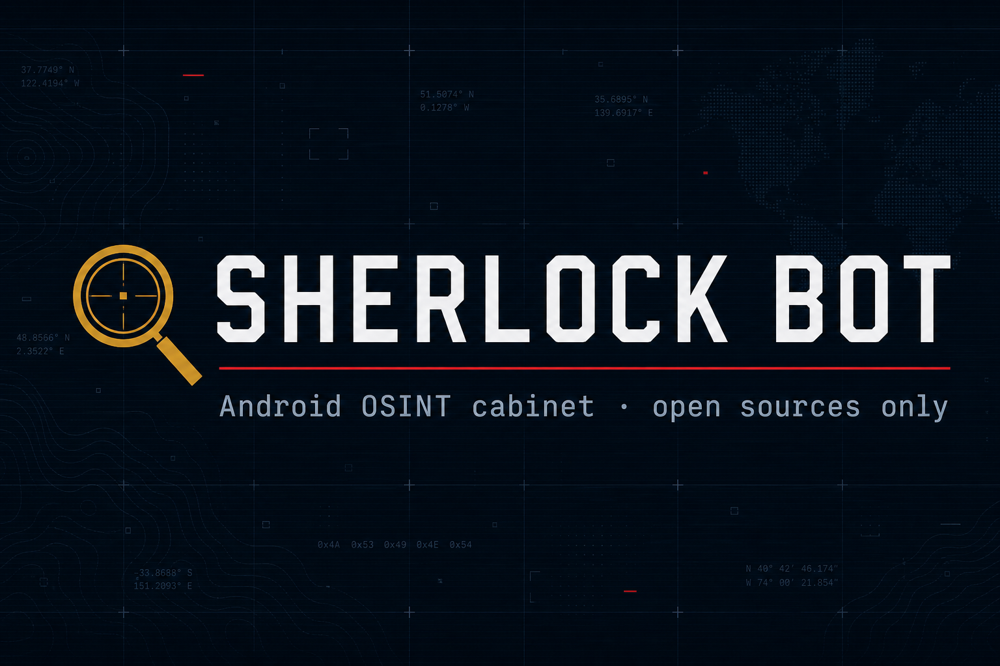
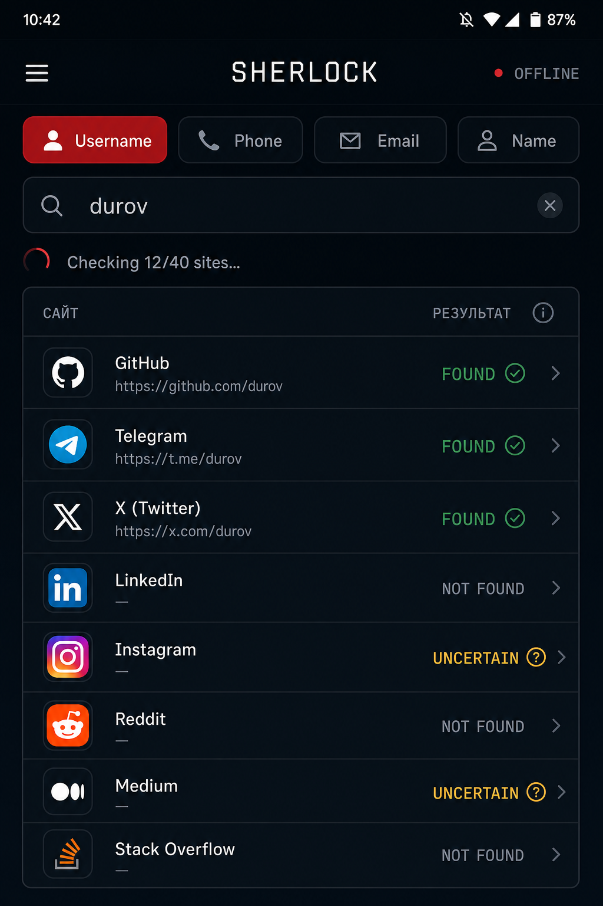
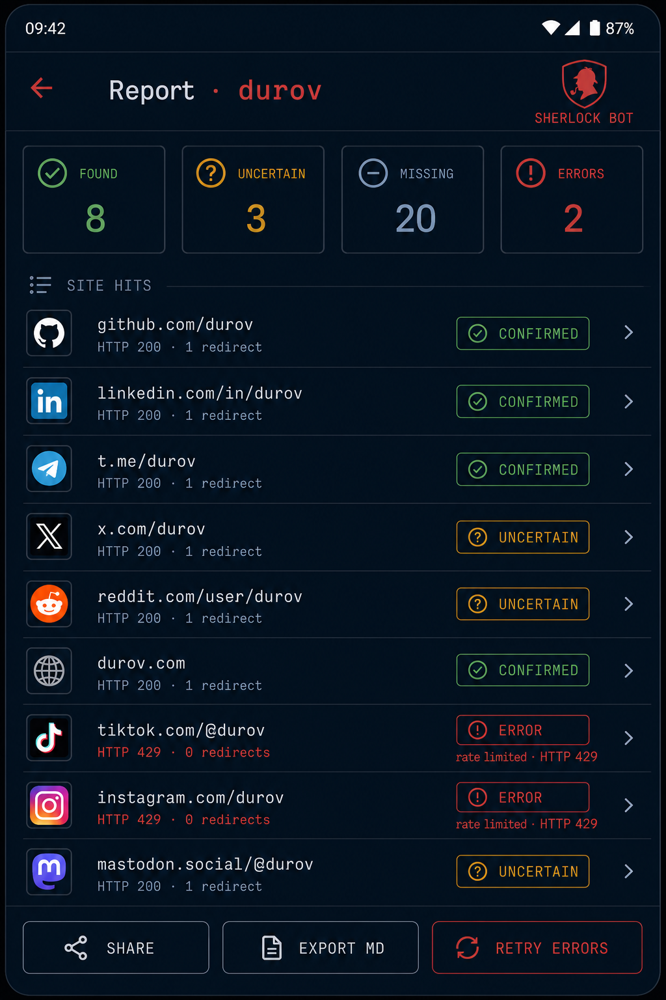

<p align="center">
  
</p>

<p align="center">
  <strong>Android OSINT-кабинет</strong> — ник · телефон · email · ФИО<br/>
  только открытые источники · на устройстве · без закрытых баз
</p>

<p align="center">
  <a href="https://github.com/Hanter1/Sherlock/actions/workflows/ci.yml"></a>
  <a href="https://github.com/Hanter1/Sherlock/releases"></a>
  
  
</p>

<p align="center">
  <a href="https://github.com/Hanter1/Sherlock/releases/latest">Скачать APK</a>
  ·
  <a href="docs/wiki/Home.md">Документация</a>
  ·
  <a href="#сборка">Сборка</a>
</p>

---

## Зачем

Sherlock Bot — тёмный console-UI для быстрых проверок по публичным страницам: ник на 40+ площадках, разбор телефона (BY/RU/UA/…), email (MX/SPF/DMARC/Gravatar), поисковые запросы по ФИО. Всё локально на телефоне; каталог площадок обновляется без переписывания Kotlin.

<p align="center">
  
  &nbsp;
  
</p>

## Возможности

| | |
|---|---|
| **Никнейм** | Каталог на базе [sherlock-project](https://github.com/sherlock-project/sherlock) (~480): пресеты Быстрый / Sherlock Full, фильтры, Δ, «добить ошибки» |
| **Телефон / Email / ФИО** | Беларусь `+375` в приоритете; MX + политика DNS; Google/Yandex/VK |
| **Кабинет** | Журнал дел, поиск по истории, закрепление отчёта, экспорт MD/JSON |
| **Надёжность** | Per-host rate limit, retry 429/5xx, HTTP-диагностика, уведомление о конце скана |
| **Каталог** | `osint_sites.json` v7 (MIT upstream + curated) · remote HTTPS · ECDSA |

Полный список — в [Usage](docs/wiki/Usage.md).

## Быстрый старт

1. Установите APK из [Releases](https://github.com/Hanter1/Sherlock/releases/latest) (debug-сборка помечена в notes).
2. Режим **Никнейм** → `durov` или команда `/username durov`.
3. Стоп — отмена mid-scan; в фоне придёт уведомление о готовности.

Примеры команд: `/compare a b` · `/username a b c` (очередь до 5) · `/clear` · `/about`.

## Стек

Kotlin · Jetpack Compose · OkHttp · Coroutines · EncryptedFile

## Сборка

Нужны JDK 17 и Android SDK.

```bat
set JAVA_HOME=C:\Program Files\Microsoft\jdk-17.0.19.10-hotspot
set ANDROID_HOME=%LOCALAPPDATA%\Android\Sdk
gradlew.bat assembleDebug
```

APK: `app\build\outputs\apk\debug\app-debug.apk`

Release (R8 + minify): скопируйте `keystore.properties.example` → `keystore.properties`, укажите `.jks`, затем `gradlew.bat assembleRelease`.

Подробнее: [Building](docs/wiki/Building.md).

CI: [`.github/workflows/ci.yml`](.github/workflows/ci.yml) — unit-тесты, `lintDebug`, debug APK.  
Каталог (недельный probe): [`scripts/probe_catalog.py`](scripts/probe_catalog.py).

## Документация

- [Home](docs/wiki/Home.md)
- [Installation](docs/wiki/Installation.md)
- [Usage](docs/wiki/Usage.md)
- [Catalog](docs/wiki/Catalog.md)
- [Privacy & Ethics](docs/wiki/Privacy-and-Ethics.md)
- [Building](docs/wiki/Building.md)

GitHub Wiki: после [создания первой страницы](https://github.com/Hanter1/Sherlock/wiki) синхронизация — `scripts/publish_wiki.ps1`.

## Важно

Приложение работает только с открытыми HTTP/DNS-источниками и **не** подключается к закрытым базам и утечкам.
